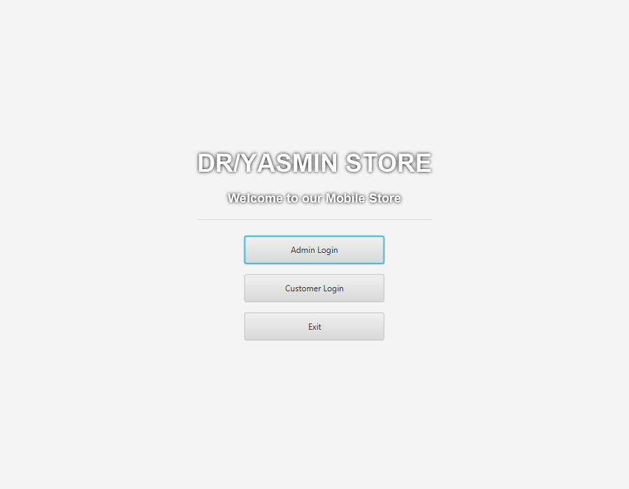
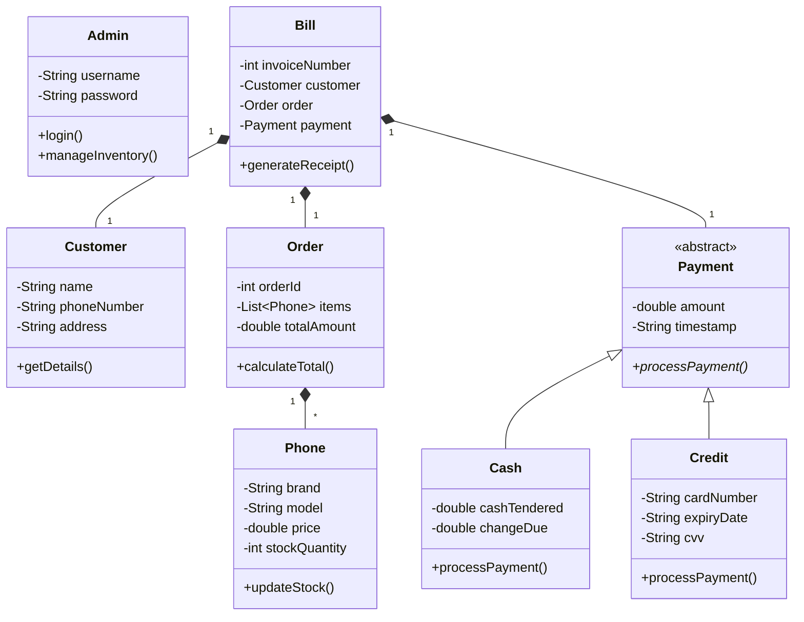

# Retail Phone Store Billing & Inventory Management System

[](https://openjdk.org)
[](https://openjfx.io)
[](https://maven.apache.org)
[](src/main/resources/css/application.css)
[](LICENSE)

A production-ready desktop **Point of Sale (POS), Inventory Control, and Automated Billing Management System** tailored for telecommunications and smartphone retail operations. Engineered in **Java 17** utilizing **JavaFX** and the **OpenJFX Maven Plugin**, the system automates end-to-end retail transactions: customer onboarding, stock replenishment, real-time inventory deduction, dual-payment processing (Cash & Credit), and persistent sales invoice generation.

Collaboratively designed and implemented by **Younss Yahya** and **Youssef**.

---

## 📸 System Showcase



---

## ✨ Enterprise Capabilities

### 🛒 Point of Sale & Checkout Workflow
- **Instant Product Lookup**: Search by device model, manufacturer, specifications, or SKU.
- **Dynamic Cart Management**: Real-time line-item subtotal calculation, tax adjustments, and order summation.
- **Dual-Channel Payment Engine**:
  - **Cash Transactions**: Validates tendered amount, calculates customer change, and issues receipt.
  - **Credit Card Settlements**: Validates 16-digit card formats, expiration timelines, CVV, and processes authorization tokens.

### 📦 Smartphone Fleet & Inventory Control
- **Comprehensive Device Catalog**: Tracks model name, brand, storage tier (GB), RAM, IMEI identifiers, cost price, retail price, and stock levels.
- **Stock Depletion & Threshold Alerts**: Automated inventory decrement upon completed transaction with low-stock warnings.
- **Catalog Management**: Add, update, price-adjust, or retire phone inventory units.

### 👥 Customer Relationship Management (CRM)
- Customer profile registry (`Customer` entity) with contact telephone, address, and lifetime purchase history.
- Returning customer lookup for accelerated checkout and loyalty tracking.

### 📄 Billing & Transaction Audit Trails
- Generates formatted, timestamped invoice records (`Bill` and `Order` entities).
- Disk persistence engine (`Files.java`) writing structured financial audit journals and customer records.

---

## 🏛️ Domain Architecture & Class Hierarchy



---

## 📁 Repository Structure

```
billing-management-system/
├── src/
│   └── main/
│       ├── java/com/billing/
│       │   ├── models/
│       │   │   ├── Admin.java       # Administrative credential authentication
│       │   │   ├── Bill.java        # Structured invoice and billing model
│       │   │   ├── Cash.java        # Cash tender and change calculator
│       │   │   ├── Credit.java      # Credit card payment processor
│       │   │   ├── Customer.java    # Retail client registry model
│       │   │   ├── Order.java       # Line items and transaction aggregator
│       │   │   ├── Payment.java     # Base abstract payment contract
│       │   │   └── Phone.java       # Smartphone inventory entity
│       │   ├── services/
│       │   │   ├── Files.java       # Flat-file I/O persistence engine
│       │   │   └── Store.java       # Core retail business logic & inventory state
│       │   └── ui/
│       │       └── Main_APP.java    # JavaFX primary stage, navigation & views
│       └── resources/
│           └── css/
│               └── application.css  # Modern JavaFX CSS theme and design system
├── docs/
│   └── screenshot.png               # High-resolution application preview
├── .gitignore                       # Standard Java/Maven exclusion rules
├── pom.xml                          # Maven build configuration & JavaFX dependencies
└── README.md                        # Master documentation
```

---

## 🛠️ Building & Running

### Prerequisites
- **JDK 17 LTS** (Oracle JDK, Eclipse Temurin, or OpenJDK)
- **Apache Maven 3.8+**
- (Optional) An IDE such as IntelliJ IDEA, Eclipse, or VS Code

### 1. Compile the Project
```bash
mvn clean compile
```

### 2. Launch the Application via JavaFX Maven Plugin
```bash
mvn javafx:run
```

### 3. Package as an Executable JAR
```bash
mvn clean package
```
The packaged build will be generated in `target/billing-management-system-1.0.0.jar`.

---

## 🎨 UI Styling
The application interface is styled using modular JavaFX CSS (`application.css`) providing:
- High-contrast responsive buttons and inputs
- Styled `TableView` controls for inventory browsing
- Floating dialog cards for invoice previews and cash/credit prompts

---

## 👥 Authors & Collaborators
- **Younss Yahya** ([@youunss](https://github.com/youunss)) — Architecture, domain models, and technical documentation.
- **Youssef** ([@youssef5520055](https://github.com/youssef5520055)) — UI design, event dispatchers, and testing.
